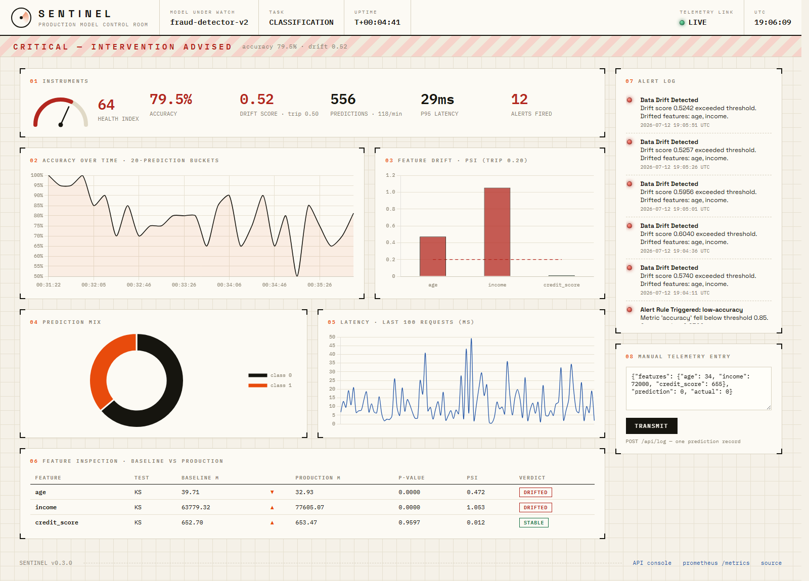
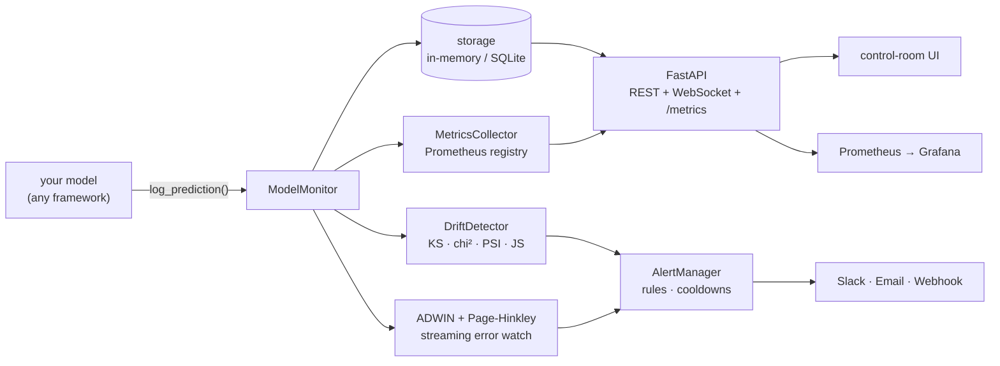

<div align="center">

# SENTINEL

**A control room for machine-learning models in production.**

[](https://github.com/Martian172/mlops-sentinel/actions/workflows/ci.yml)


### ▶ [Live demo](https://mlops-sentinel.onrender.com) · [API console](https://mlops-sentinel.onrender.com/docs)

*Your model was 95% accurate at launch. It's 71% today. Nobody noticed —
because a decaying model doesn't crash. It just quietly starts being wrong.*

> The live demo runs on Render's free tier, so the first visit after it's been
> idle may take ~30–50 s to wake up. Give it a moment.



*Live capture: Sentinel catching demographic drift in a fraud model —
`age` and `income` tripped their PSI limits, `credit_score` held stable,
and the status board dropped from NOMINAL to CRITICAL.*

</div>

---

## The problem

Every deployed ML model is a bet that the future will look like the training
data. The future disagrees: customers get younger, prices inflate, fraudsters
adapt. This is **drift**, and it is invisible to normal monitoring — CPU is
fine, latency is fine, HTTP 200s all around. The predictions are just wrong.

Worse: at prediction time you usually *can't check accuracy*, because the
ground truth (did the loan default? was it fraud?) arrives weeks later.

Sentinel attacks this from three angles:

| Question | Needs labels? | How Sentinel answers it |
|---|---|---|
| Do inputs still look like training data? | **No** | KS test, chi-square, PSI, JS divergence per feature |
| Has the input→output relationship changed? | Errors only | Streaming ADWIN + Page-Hinkley on the error rate |
| Is the model still performing? | Yes (late is fine) | Accuracy/F1/MAE tracked as ground truth arrives |

When something trips, Sentinel tells you **which feature broke, by how much,
and since when** — then pings Slack, email, or any webhook.

## 60-second start

```bash
git clone https://github.com/Martian172/mlops-sentinel.git
cd mlops-sentinel
pip install -r requirements.txt
python run_demo.py
```

Open **http://127.0.0.1:8001**. You're watching a simulated fraud model under
live traffic. After ~2 minutes its customers start drifting younger and richer
— watch the PSI bars climb, the accuracy line sag, and the alert log light up.
(Impatient? `SENTINEL_DRIFT_MIN=0.5 python run_demo.py` starts the decay at
30 seconds.)

## Monitor your own model

```python
from sentinel import ModelMonitor
import numpy as np

monitor = ModelMonitor(
    model_name="fraud-detector-v2",
    baseline_data=X_train,                      # what "normal" looks like
    feature_names=["amount", "hour", "country"],
)

# in your serving path — one call per prediction
record_id = monitor.log_prediction(
    features={"amount": 142.5, "hour": 14, "country": 1},
    prediction=0,
    latency_ms=12.4,
)

# ground truth arrives three weeks later? no problem
monitor.update_actual(record_id, actual=1)

report = monitor.get_drift_report()
print(report.is_drifted, report.drifted_features)
```

Or wrap a scikit-learn estimator — the training data becomes the drift
baseline automatically:

```python
from sklearn.ensemble import RandomForestClassifier
from sentinel.integrations.sklearn import SentinelClassifier

clf = SentinelClassifier(
    model=RandomForestClassifier(n_estimators=100),
    model_name="churn-predictor",
)
clf.fit(X_train, y_train)     # X_train captured as baseline
clf.predict(X_test)           # every prediction logged
clf.monitor.get_drift_report()
```

## Alerting

```python
from sentinel.core.alerts import AlertManager, AlertRule, SlackAlertChannel

alerts = AlertManager()
alerts.add_channel(SlackAlertChannel(webhook_url="https://hooks.slack.com/..."))
alerts.add_rule(AlertRule("accuracy-floor", metric="accuracy",
                          threshold=0.85, comparison="lt", severity="CRITICAL"))
alerts.add_rule(AlertRule("drift-ceiling", metric="drift_score",
                          threshold=0.60, comparison="gt", severity="WARNING"))

monitor = ModelMonitor("my-model", alert_manager=alerts)
```

Rules support `gt/lt/gte/lte/eq`, per-rule cooldowns (default 300 s — a
flapping metric won't spam your channel), and three channels out of the box:
Slack webhooks, SMTP email (plain + HTML), and generic HTTP webhooks. Concept
drift fires a CRITICAL alert automatically the moment the error rate shifts.

## The full stack, one command

```bash
cd docker && docker compose up -d --build
```

| Service | URL | What it does |
|---|---|---|
| Sentinel | http://localhost:8080 | control room + demo model under live traffic |
| Prometheus | http://localhost:9090 | scrapes `/metrics` every 15 s — try `sentinel_drift_score` |
| Grafana | http://localhost:3000 | dashboards on top (login `admin` / `sentinel123`) |

Six native Prometheus series are exposed, all labeled by model:
`sentinel_predictions_total`, `sentinel_prediction_latency_seconds` (histogram),
`sentinel_accuracy`, `sentinel_drift_score`, `sentinel_alerts_total`,
`sentinel_error_rate`.

## Monitoring API — watch any model over HTTP

Sentinel is also a **monitoring-as-a-service API**: point a model in *any*
language at a running Sentinel server and get drift detection, performance
tracking, and alerting back over plain HTTP — no need to import Sentinel in
your code. One server watches any number of models (multi-tenant).

```bash
# 1. Register your model (baseline = your training rows)
curl -X POST http://localhost:8001/api/v1/models -H 'Content-Type: application/json' \
  -d '{"model_name":"fraud-v2","feature_names":["age","income"],
       "baseline_data":[[40,65000],[38,62000],[45,71000]]}'
#   → {"model_id":"fraud-v2-1a2b3c4d", ...}

# 2. Stream predictions from your serving loop
curl -X POST http://localhost:8001/api/v1/models/fraud-v2-1a2b3c4d/predictions \
  -H 'Content-Type: application/json' \
  -d '{"features":{"age":41,"income":66000},"prediction":0,"latency_ms":12}'

# 3. Pull a drift report anytime
curl http://localhost:8001/api/v1/models/fraud-v2-1a2b3c4d/drift
```

Full endpoint reference in **[API.md](API.md)**; a runnable Python client is in
[`examples/api_client.py`](examples/api_client.py); an interactive Swagger
console is served at **`/docs`**. Optional bearer-token auth via the
`SENTINEL_API_TOKEN` env var.

## Dashboard REST endpoints & CLI

The dashboard is an ordinary FastAPI app — everything on screen is available
as JSON:

| Endpoint | Returns |
|---|---|
| `GET /api/snapshot` | live counters, health, latency history, class mix |
| `GET /api/drift` | full drift report, per-feature statistics |
| `GET /api/performance?bucket_size=20` | accuracy over time, bucketed |
| `GET /api/alerts` | recent alert history |
| `POST /api/log` | log a prediction over HTTP |
| `GET /metrics` | Prometheus text exposition |

The CLI talks to the same API (point it anywhere with `SENTINEL_API`):

```bash
sentinel monitor start --port 8080     # serve the dashboard
sentinel report drift                  # feature-by-feature drift table
sentinel report performance            # accuracy / F1 / latency table
sentinel alerts list                   # recent alerts
sentinel alerts test --slack-webhook https://hooks.slack.com/...
```

## How it works



The decisions that matter:

- **Statistical tests decide, scores describe.** A feature is "drifted" only
  when a real test says so (KS p < 0.05, or PSI > 0.20). The blended 0–1
  drift score is for dashboards and severity — it never makes the call alone,
  because `1 − p` has a noise floor even on identical distributions.
- **Monitoring never breaks serving.** Storage failures, drift-check errors,
  and dead Slack webhooks are caught, logged, and counted — `log_prediction()`
  stays O(1) and never raises. Drift checks run every N predictions
  (default 100), not on the hot path.
- **Everything is swappable.** `StorageBackend` is an ABC (in-memory and
  SQLite ship in the box); alert channels share one base class; the Prometheus
  registry is per-monitor so several models coexist in one process.
- **Labels can be late.** `log_prediction()` returns an ID;
  `update_actual(id, truth)` attaches ground truth whenever it shows up.

## Configuration

| Env var | Default | Meaning |
|---|---|---|
| `SENTINEL_HOST` / `SENTINEL_PORT` | `127.0.0.1` / `8001` | demo server bind (`PORT` also honored) |
| `SENTINEL_DRIFT_MIN` | `2` | minutes before simulated drift begins |
| `SENTINEL_API` | `http://127.0.0.1:8001` | dashboard URL the CLI queries |

## Run it in the cloud

- **GitHub Codespaces** — open this repo in a Codespace, run
  `pip install -r requirements.txt && python run_demo.py`, and Codespaces
  forwards port 8001 to a shareable URL.
- **Render / Railway / Fly** — deploy the included `docker/Dockerfile`
  (repo root as build context). The demo honors the platform's `PORT`
  variable; a ready-made [`render.yaml`](render.yaml) blueprint is included.

## Project layout

```
sentinel/
├── core/            monitor.py · drift.py · alerts.py · metrics.py
├── api/             registry.py · routes.py · schemas.py  (multi-tenant /api/v1)
├── dashboard/       app.py (FastAPI) · templates/ · static/ (vendored Chart.js)
├── storage/         backend.py (ABC · in-memory · SQLite)
├── integrations/    sklearn.py
└── cli/             commands.py (Click + Rich)
tests/               31 tests · seeded, deterministic
docker/              Dockerfile · docker-compose.yml · prometheus.yml
```

```bash
pip install -r requirements-dev.txt
pytest tests/ -q            # 31 passed
flake8 sentinel --max-line-length=120
```

## Want to understand every line?

**[LEARN.md](LEARN.md)** is a from-zero walkthrough of everything this
project touches — the statistics (what a p-value actually is, why PSI has a
0.2 threshold, how ADWIN's Hoeffding bound works), the engineering (FastAPI,
WebSockets, Prometheus internals, Docker networking, CI), with curated video
picks per topic. If you can read Python, you can rebuild this project from
that file.

## License

MIT — see [LICENSE](LICENSE).
